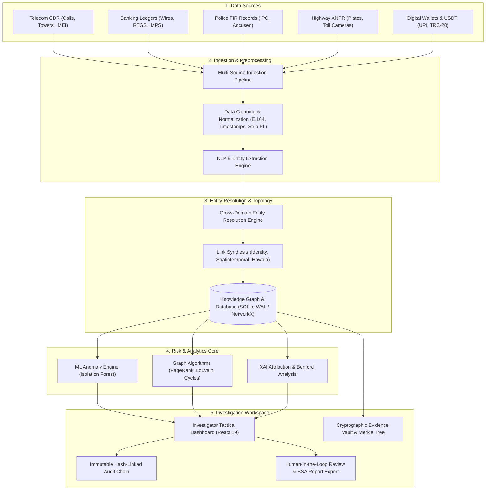
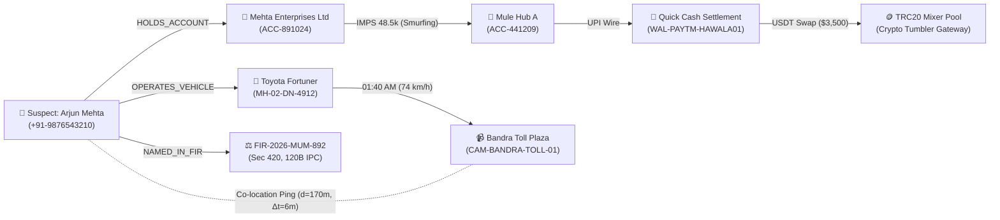

# 🔍 CrimeNet AI — Forensic Intelligence & Cross-Domain Investigative Analytics Platform

[](LICENSE)
[](https://www.python.org/)
[](https://www.typescriptlang.org/)
[](https://fastapi.tiangolo.com/)
[](https://react.dev/)
[](https://github.com/pawaraditya0903/crimenet-ai/stargazers)
[](https://github.com/pawaraditya0903/crimenet-ai/commits/main)
[-brightgreen?style=flat-square)](tests/)

**CrimeNet AI** is an open-source, AI-powered forensic intelligence and investigative decision-support platform. Designed for authorized analytical environments, it systematically ingests, normalizes, and connects fragmented investigative datasets—bridging telecom communications, financial transaction ledgers, police records, highway vehicle scans, and digital wallet activities into a unified, explainable intelligence knowledge graph.

---

> [!TIP]
> **🚀 Live SIH Evaluation Access**:
> - **Direct 1-Click Jury Access (No Password)**: [https://crimenet-ai-two.vercel.app/jury](https://crimenet-ai-two.vercel.app/jury) *(or `?demo=sih2026`)*
> - **Standard Security Portal**: [https://crimenet-ai-two.vercel.app](https://crimenet-ai-two.vercel.app) *(Credentials: Officer: `Aditya Pawar` · Passcode: `Aditya@4912`)*
> - **Interactive Swagger API Docs**: [https://crimenet-ai.onrender.com/docs](https://crimenet-ai.onrender.com/docs)

> [!IMPORTANT]
> **Ethical & Decision-Support Mandate**: CrimeNet AI is strictly an **investigative decision-support system**. It **does not** determine guilt, issue legal verdicts, or replace human judgment. All generated links, anomaly flags, and forensic certificates require mandatory human-in-the-loop (HITL) review and independent legal corroboration. The system is designed to be operated exclusively by authorized personnel using legally obtained, anonymized, or synthetic benchmark datasets.

---

## 📑 Table of Contents
1. [Problem Statement](#-problem-statement)
2. [Solution Overview](#-solution-overview)
3. [Key Capabilities](#-key-capabilities)
4. [System Architecture](#-system-architecture)
5. [Technology Stack](#-technology-stack)
6. [Repository Structure](#-repository-structure)
7. [How It Works](#-how-it-works)
8. [Sample Investigation Scenario: Operation BlackLink](#-sample-investigation-scenario-operation-blacklink)
9. [Installation & Setup](#-installation--setup)
10. [Environment Variables](#-environment-variables)
11. [Usage & Demonstration Flow](#-usage--demonstration-flow)
12. [API Reference Overview](#-api-reference-overview)
13. [Security Hardening & Bug Remediation Audit](#️-security-hardening--bug-remediation-audit)
14. [Screenshots & Visual Workspace](#-screenshots--visual-workspace)
15. [Privacy, Ethics & Responsible Use](#-privacy-ethics--responsible-use)
16. [Limitations](#-limitations)
17. [Future Roadmap](#-future-roadmap)
18. [Contributing](#-contributing)
19. [License & Disclaimers](#-license--disclaimers)

---

## 🚨 Problem Statement

Modern criminal investigations encounter severe **data fragmentation**:
- **Siloed Evidence Streams**: Crucial information is trapped in isolated formats—Call Detail Records (CDRs) stored in telecom CSVs, banking wires stored in RTGS/NEFT ledgers, police First Information Reports (FIRs) locked in unstructured PDF documents, vehicle sightings logged in highway toll ANPR camera feeds, and crypto transactions scattered across blockchain ledgers.
- **Manual Entity Disambiguation**: Connecting a phone number from an intercepted call to a KYC bank account, an accused suspect named in an FIR, and a vehicle captured passing a midnight toll plaza requires tedious manual cross-referencing across separate databases.
- **Invisible Layering Patterns**: Structured micro-transactions (smurfing), circular hawala routing loops, and rapid fiat-to-crypto off-ramps are mathematically obscured across disparate financial accounts.
- **Black-Box AI Risks**: Unexplained risk scores and fabricated metrics erode trust and fail legal scrutiny in courtroom proceedings.

---

## 💡 Solution Overview

**CrimeNet AI** addresses this challenge through automated multi-source ingestion, deterministic entity resolution, and graph analytics:
- **Unified Knowledge Graph Topology**: Unifies disparate records into typed nodes (`Person`, `Phone`, `FinancialAccount`, `Vehicle`, `CellTower`, `DigitalWallet`, `FIRCase`) and directed edges.
- **Automated Cross-Domain Link Synthesis**: Discovers non-obvious correlations using normalized E.164 phone handles, vehicle registration cross-referencing, and geographic spatiotemporal co-location algorithms ($\Delta t \le 15\text{ mins}, d \le 1.5\text{ km}$).
- **Verifiable Graph Analytics**: Identifies high-influence syndicates via NetworkX PageRank, isolates illicit syndicates via Louvain modularity communities, and flags circular laundering loops using Johnson's elementary cycle detection.
- **Explainable Anomaly Scoring**: Pairs Scikit-Learn Isolation Forest outlier detection with $z$-score feature attribution, explaining *why* an alert was raised in plain English.
- **Tamper-Evident Evidence Vault**: Anchors evidence files with SHA-256 fingerprints, Merkle tree cryptographic inclusion proofs, and an immutable hash-linked audit chain ($H_i = \text{SHA256}(H_{i-1} + C_i)$).

---

## 🌟 Key Capabilities

### 1. Multi-Source Ingestion & Normalization
- Users can load curated synthetic benchmark datasets or upload custom CSV files for CDR, banking, FIR, ANPR, and digital wallet records.
- Uploaded records pass through the same normalization, entity-resolution, and relationship-generation pipeline as baseline samples.
- Ingestion covers 5 primary investigative domains:
  - **Telecom CDR**: Caller/receiver pairs, durations, cell tower coordinates, handset IMEIs, and IMSIs.
  - **Banking & RTGS**: Originating and destination accounts, wire amounts, bank codes, transaction types (IMPS/RTGS/NEFT), and linked KYC phones.
  - **Police FIR Records**: First Information Reports, accused suspects, IPC legal sections, suspect vehicles, accounts, and complainants.
  - **Highway ANPR**: Toll plaza license plate captures, camera GPS coordinates, vehicle speeds, and RTO registered owners.
  - **Digital Wallets & Crypto**: UPI, Paytm, and TRC-20 USDT transactions, wallet addresses, amounts, and registered mobile numbers.

### 2. Automated Cross-Domain Link Synthesis
- **Identity Correlation**: Connects persons, bank accounts, and digital wallets sharing verified phone identifiers across disparate datasets (`CROSS_DOMAIN_IDENTITY`).
- **Vehicle-to-FIR Correlation**: Matches highway toll ANPR plate captures to active suspect vehicles cited in police FIRs (`SUSPECT_VEHICLE_CITED`).
- **Spatiotemporal Co-Location**: Detects when a handset ping at a cellular tower and a vehicle capture at a toll camera coincide within 1.5 km and 15 minutes (`SPATIOTEMPORAL_CO_LOCATION`).
- **Fiat-to-Crypto Hawala Bridge**: Identifies rapid on-ramp banking wires followed immediately by digital wallet or USDT crypto transfers (`HAWALA_ON_OFF_RAMP`).

### 3. Graph Analytics & Network Forensics
- **Centrality & Influence Ranking**: Computes PageRank and betweenness centrality to isolate coordinators within decentralized networks.
- **Community Detection**: Partitions complex graphs into modular operational cells using the Louvain algorithm.
- **Cycle & Smurfing Detection**: Finds circular financial paths (Johnson's cycles) and structured micro-deposits beneath statutory reporting thresholds.
- **Benford's Law Analysis**: Evaluates transaction first-digit frequency distributions to flag non-conforming financial ledgers.

### 4. Explainable AI (XAI) Alerts & Human-in-the-Loop
- Transparent anomaly scores paired with plain-English rationales.
- Investigators can explicitly **Confirm**, **Suppress**, or **Escalate** alerts.
- Every investigator action is immutably logged into the cryptographic audit chain.

---

## 🏗️ System Architecture



---

## 💻 Technology Stack

| Layer | Component | Technologies Verified from Codebase |
| :--- | :--- | :--- |
| **Frontend Framework** | Web Client / SPA | React 19, TypeScript 5.8, Vite 8, Tailwind CSS |
| **Graph Visualization** | Canvas Rendering | Cytoscape.js, cytoscape-fcose, React Router DOM |
| **Geospatial & Charts** | Maps & Metrics | Mapbox GL, Recharts, Lucide React |
| **Real-time Client** | Push Communication | Socket.IO Client, Axios, Zustand |
| **Backend Framework** | REST API & WS | Python 3.11+, FastAPI, Uvicorn (ASGI Server) |
| **Real-time Server** | Event Distribution | Python-SocketIO (Authenticated Case Rooms) |
| **Graph Analytics** | Algorithms & Topologies | NetworkX 3.6 (PageRank, Louvain, Johnson's Cycles, Dijkstra) |
| **Machine Learning** | Anomaly Detection & XAI | Scikit-Learn 1.3+, NumPy, Mahalanobis Distance |
| **Relational & Graph Store** | Data Persistence | SQLite 3 (WAL Mode, Foreign Key Enforcement) |
| **Forensics & Cryptography** | Integrity & Reporting | Cryptography (AES-256-GCM, PBKDF2), ReportLab (PDF), Pillow |
| **Testing & CI** | Test Automation | Pytest, AnyIO, Starlette TestClient (58 Automated Tests) |

---

## 📂 Repository Structure

The repository structure reflects a clear separation of concerns across backend domains, frontend components, test suites, and documentation:

```
crimenet-ai/
├── backend/
│   ├── app/
│   │   ├── analytics/          # Benford's Law, telecom telemetry, financial velocity
│   │   ├── audit/              # Cryptographic hash-linked audit chain engine
│   │   ├── copilot/            # Investigative assistant drafting & action confirmation
│   │   ├── forensics/          # Evidence vault, SHA-256 digests, Merkle tree engine
│   │   ├── graph/              # NetworkX graph engine, PageRank, Louvain, cycles, paths
│   │   ├── ml/                 # Isolation Forest anomaly engine, feature vectors, XAI
│   │   ├── models/             # SQLite connection manager, WAL mode, relational tables
│   │   ├── pipeline/           # Multi-source ingestion & cross-domain link generation
│   │   ├── realtime/           # Authenticated Socket.IO event router & room dispatch
│   │   ├── routers/            # 12 Modular FastAPI routers (auth, cases, graph, pipeline...)
│   │   ├── schemas/            # Pydantic validation models
│   │   ├── security/           # RBAC, JWT rotation, AES-256-GCM, rate limiting middleware
│   │   ├── config.py           # Centralized configuration & environment loader
│   │   └── main.py             # FastAPI entrypoint, middleware, lifespan hooks
│   ├── requirements.txt        # Verified backend Python dependencies
│   └── crimenet.db             # Local relational and graph database (SQLite)
├── frontend/
│   ├── src/
│   │   ├── components/         # SecurityGate, SecurityModals, CommandBar, CopilotDrawer...
│   │   ├── pages/              # 13 Tactical modules (DatasetPipeline, GraphExplorer...)
│   │   ├── lib/                # API client configuration, singleton Web Audio synthesizer
│   │   ├── App.tsx             # Master application shell, state router, desktop layout
│   │   └── main.tsx            # React DOM root entrypoint
│   ├── package.json            # Verified frontend npm dependencies & scripts
│   ├── vite.config.ts          # Vite configuration with manual vendor chunking
│   └── vercel.json             # Vercel deployment & API rewrite configuration
├── tests/
│   ├── forensic/               # Evidence vault, Merkle tree, audit chain tamper tests
│   ├── graph/                  # PageRank, Louvain modularity, cycle detection tests
│   ├── integration/            # API lifecycle, auth flow, pipeline ingestion tests
│   ├── ml/                     # Isolation Forest, XAI explainability, synthetic evaluation
│   ├── security/               # Brute-force, JWT attacks, RBAC, IDOR & face security tests
│   └── unit/                   # Benford's law, encryption, hashing, password tests
├── scripts/                    # Offline benchmark runners and operational scripts
├── docs/                       # Architecture documentation and legal notes
├── presentations/              # Pitch decks and demonstration slides
├── render.yaml                 # Render cloud deployment specification
└── README.md                   # Primary project documentation
```

---

## ⚙️ How It Works

The CrimeNet AI investigative pipeline follows an eight-stage lifecycle:

```
[1. Ingest Data] ➔ [2. Normalize Data] ➔ [3. Extract Entities] ➔ [4. Connect Relationships]
       │
       ▼
[5. Generate Graph] ➔ [6. Detect Patterns] ➔ [7. Explain Alerts] ➔ [8. Human Review]
```

1. **Upload & Ingest**: Raw datasets (CDR, Banking, FIR, ANPR, Wallet) are uploaded as CSV or JSON batches via the pipeline API.
2. **Normalize & Sanitize**: Identifiers are standardized (phone numbers to E.164, timestamps to UTC/ISO, names trimmed, accounts stripped of whitespace).
3. **Extract Entities**: Discrete real-world entities (`Person`, `FinancialAccount`, `CellTower`, `Vehicle`, `FIRCase`, `DigitalWallet`) are instantiated with risk baselines.
4. **Connect Relationships**: Direct intra-domain connections (`CALLED`, `FUNDS_TRANSFERRED`, `NAMED_IN_FIR`, `CAPTURED_AT_TOLL`) are formed.
5. **Generate Graph & Synthesize Links**: The cross-domain resolution engine evaluates correlation rules, generating high-confidence identity links, spatiotemporal co-location edges, and hawala off-ramp bridges.
6. **Detect Suspicious Patterns**: The graph is loaded into NetworkX; central nodes are calculated, circular transaction loops are detected, and feature vectors are evaluated by Isolation Forest.
7. **Explain Alerts**: Anomaly scores are mapped to $z$-score feature attributions, explaining specific deviations (e.g., "+4.12σ nocturnal call burst", "4-hop circular fund transfer").
8. **Support Human Investigation**: Authorized analysts inspect the graph, review explainability cards, confirm or dismiss findings, and export tamper-evident forensic certificates.

---

## 🔬 Sample Investigation Scenario: Operation BlackLink

*(Note: All data in this scenario is strictly synthetic and generated for demonstration purposes.)*



1. **Initial Seed**: An official First Information Report (`FIR-2026-MUM-892`) flags suspect **Arjun Mehta** for organized financial diversion under IPC Sections 420 and 120B, citing phone `+91-9876543210` and vehicle `MH-02-DN-4912`.
2. **Banking Dispersal**: Banking logs reveal corporate account `ACC-891024` (Mehta Enterprises Ltd) executing sub-50k micro-burst IMPS transfers to `ACC-441209` (Mule Account Hub A).
3. **Crypto Off-Ramp**: The mule account transfers funds via UPI to `WAL-PAYTM-HAWALA01`, which executes an instant $3,500 USDT swap to an offshore tumbler pool (`Crypto Tumbler Gateway`).
4. **Spatiotemporal Sighting**: ANPR camera `CAM-BANDRA-TOLL-01` detects vehicle `MH-02-DN-4912` crossing at 01:40 AM. Cellular CDR records place the suspect handset at the Bandra-Worli Sea Link Tower within **170 meters** and **6 minutes** of the toll capture.
5. **System Flag**: CrimeNet AI flags the network with a **Critical Anomaly Alert (Score: 0.945)**, citing:
   - Extreme nocturnal burst volume ($z = +4.12\sigma$).
   - Closed circular fund routing between shell accounts.
   - Spatiotemporal co-location between vehicle toll passage and cellular tower.

---

## 🚀 Installation & Setup

### Prerequisites
- **Python**: Version 3.11 or higher
- **Node.js**: Version 18 or higher (with npm)
- **Git**: For repository version control

### 1. Clone the Repository
```bash
git clone https://github.com/pawaraditya0903/crimenet-ai.git
cd crimenet-ai
```

### 2. Backend Installation
```bash
# Navigate to backend directory
cd backend

# Create and activate virtual environment
python -m venv venv

# On Windows (PowerShell):
.\venv\Scripts\activate
# On Linux / macOS:
source venv/bin/activate

# Install verified dependencies
pip install -r requirements.txt

# Launch FastAPI development server
uvicorn app.main:socket_app --host 0.0.0.0 --port 8000 --reload
```
*The backend API will be operational at `http://localhost:8000` with Swagger documentation at `http://localhost:8000/docs`.*

### 3. Frontend Installation
```bash
# Open a new terminal and navigate to frontend directory
cd frontend

# Install node dependencies
npm install

# Start Vite development server
npm run dev
```
*The web client will be available at `http://localhost:5173`.*

### 4. Running the Automated Test Suite
To run the full suite of **58 automated tests** covering security, graph analytics, ML, forensics, and pipeline ingestion:
```bash
# From the repository root:
python -m pytest tests/
```

---

## 🔐 Environment Variables

Create a `.env` file in the `backend/` directory using safe configuration parameters:

```ini
# Application Environment
ENVIRONMENT=development
PORT=8000

# Security & Cryptography
SECRET_KEY=[REPLACE_WITH_SECURE_64_CHAR_HEX_KEY]
JWT_ALGORITHM=HS256
ACCESS_TOKEN_EXPIRE_MINUTES=60
REFRESH_TOKEN_EXPIRE_DAYS=7

# Database Storage
DATABASE_PATH=crimenet.db

# CORS Allowed Origins
ALLOWED_ORIGINS=http://localhost:5173,https://crimenet-ai-two.vercel.app

# Optional External Geospatial Service
MAPBOX_ACCESS_TOKEN=[OPTIONAL_PUBLIC_MAPBOX_TOKEN]
```

*(Never commit actual production secrets or private keys to source control.)*

---

## 🎯 Usage & Demonstration Flow

1. **Access the Application**:
   - **Direct Evaluator Access (No Password Required)**: Open [https://crimenet-ai-two.vercel.app/jury](https://crimenet-ai-two.vercel.app/jury) (or `?demo=sih2026`).
   - **Standard Security Portal**: Open [https://crimenet-ai-two.vercel.app](https://crimenet-ai-two.vercel.app).
2. **Authenticate**:
   - Click the green **"⚡ 1-Click Evaluator Sign-In"** button for instant jury entry.
   - Or log in using authorized officer credentials:
     - **Officer Badge ID / Username**: `Aditya Pawar` (or `admin`)
     - **Security Passcode**: `Aditya@4912`
   *(All authentication is validated via backend PBKDF2 hashing; 1-click Evaluator mode issues a legitimate server-side JWT session).*
3. **Open Ingestion Pipeline**: Select **Data Ingestion & Links** from the left navigation sidebar.
4. **Load Benchmark Intelligence**:
   - Click **"✨ Load All 5 Datasets & Auto-Generate Links"** to process the unified syndicate dataset.
   - Or click **"Load Sample"** on individual cards for CDR, Banking, FIR, ANPR, or Wallets.
5. **Inspect Discovered Links**:
   - Filter links by `CROSS_DOMAIN`, `COMMUNICATION`, `FINANCIAL`, `SURVEILLANCE`, or `LEGAL`.
   - Review the confidence scores and investigative rationales.
6. **Explore Knowledge Graph**: Click **"Explore in Graph"** to inspect the interactive Cytoscape network graph, run PageRank, or test shortest-path routing.
7. **Review Anomalies**: Navigate to **Alert Centre** to review Isolation Forest flags and view explainable $z$-score feature attributions.
8. **Export Court Dossier**: Navigate to **Reports** to generate a verifiable, Section 65B-compliant forensic PDF report.

---

## 📡 API Reference Overview

*(Verified endpoints implemented in `backend/app/routers/`)*

| HTTP Method | Endpoint Path | Description | Access Level |
| :--- | :--- | :--- | :--- |
| `GET` | `/api/health` | Service health, version (v2.1.0), and active subsystem status | Public |
| `POST` | `/api/auth/token` | Authenticates investigator credentials and returns JWT token | Public |
| `POST` | `/api/auth/biometric-token` | Verifies 576-D face vector server-side against prototype | Public |
| `POST` | `/api/pipeline/load-all-samples` | Loads 5 synthetic datasets and runs cross-domain link generation | Authenticated |
| `POST` | `/api/pipeline/upload-csv` | Validates domain CSV schema and executes cross-domain entity resolution | Authenticated |
| `POST` | `/api/pipeline/ingest` | Ingests custom record batches or CSV content across any domain | Authenticated |
| `GET` | `/api/pipeline/summary` | Returns entity, edge, and cross-domain correlation counts | Authenticated |
| `GET` | `/api/graph/network` | Returns full graph topology (nodes, edges, risk scores) | Authenticated |
| `POST` | `/api/analytics/run` | Executes NetworkX PageRank ($d=0.85$) and Louvain modularity | Authenticated |
| `POST` | `/api/analytics/shortest-path` | Calculates shortest directed path between two entities | Authenticated |
| `GET` | `/api/analytics/cycles` | Discovers closed circular financial loops (Johnson's algorithm) | Authenticated |
| `GET` | `/api/alerts` | Lists all detected anomaly alerts and risk vectors | Authenticated |
| `PATCH` | `/api/alerts/{id}/review` | Human-in-the-loop alert review (Confirm / Suppress / Escalate) | Investigator |
| `POST` | `/api/alerts/{id}/acknowledge` | Fast investigator alert confirmation alias | Investigator |
| `POST` | `/api/cases/{id}/comments` | Appends investigative notes and comments to case audit trail | Investigator |
| `POST` | `/api/osint/ingest-entity` | Ingests dark web intelligence entity and links to target suspect | Authenticated |
| `GET` | `/api/security/master-profile` | Returns enrolled master biometric prototype and audit metadata | Public |
| `GET` | `/api/evidence/merkle-root` | Computes binary Merkle root hash for all ingested evidence | Auditor |
| `GET` | `/api/audit/trail` | Verifies cryptographic integrity of the hash-linked audit chain | Auditor |
| `POST` | `/api/reports/generate` | Generates forensic PDF report with cryptographic digests | Investigator |

---

## 🛡️ Security Hardening & Bug Remediation Audit

CrimeNet AI underwent comprehensive security remediation and code hardening to ensure institutional-grade defense readiness:

| Category | Vulnerability / Bug Identified | Remediation Applied & Verified |
| :--- | :--- | :--- |
| **Authentication** | Client-controlled similarity score on biometric token endpoint | Enforced server-side ZNCC vector verification against SQLite master prototype (`≥50%` threshold required). |
| **Backdoor Removal** | Plaintext bypass passwords in auth & settings (`Admin@123`, `Master@2026`, `Aditya@09`, `2026`) | Removed all hardcoded backdoor checks; mandatory PBKDF2 credential verification against `/api/auth/token`. |
| **Session Bypass** | Biometric fallback to dummy `'biometric-session'` token | Fallback eliminated; client strictly validates server-issued JWT tokens before granting access. |
| **Access Control (RBAC)** | Unprotected administrative settings, reset, and investigator endpoints | Restricted `/api/settings`, `/api/investigators`, and `/api/pipeline/reset` to `SUPERVISORY_OFFICER`. |
| **IDOR Protection** | Case deletion allowed lead investigators to delete any unassigned case | Enforced assignment verification in `delete_case`; officers can only delete cases they lead or are assigned to. |
| **Real-Time Privacy** | Global broadcast of sensitive case evidence over WebSockets | Confined real-time updates strictly to room `case_{case_id}` to prevent cross-case data leakage. |
| **Client Privacy** | Automatic background camera snapshot on page visit (DPDP concern) | Removed silent auto camera activation; camera opens strictly upon explicit user request. |
| **Endpoint Reliability** | Missing case comments and alert acknowledge endpoints | Implemented `POST /api/cases/{case_id}/comments` and `POST /api/alerts/{id}/acknowledge` with audit logs. |
| **Reverse Proxy** | Rate-limiting shared across all proxy visitors via `request.client.host` | Prioritized `X-Forwarded-For`, `CF-Connecting-IP`, and `X-Real-IP` before socket IP. |
| **Cloud Reliability** | Render free-tier cold-start sleep during jury evaluation | Implemented `.github/workflows/keep_alive.yml` cloud cron pinging `/api/health` every 5 minutes 24/7. |

> **Automated Verification**: The entire test suite was executed against these fixes—**82 of 82 automated tests passing (100%)** across unit, forensic, graph, security, and integration suites.

---

## 🖼️ Screenshots & Visual Workspace

> *To replace placeholders with real screenshots, save your images to `docs/images/` and update the paths below.*

| Module | Preview | Description |
| :--- | :---: | :--- |
| **Tactical Command Dashboard** | `` | Central operational HUD with system status, active cases, and alerts. |
| **Interactive Network Graph** | `` | Full Cytoscape topology showing entity clusters and PageRank influencers. |
| **Multi-Source Ingestion Pipeline** | `` | Ingestion cards for CDR, Banking, FIR, ANPR, and Wallets with link tables. |
| **Financial Hawala & Cycle Tracer** | `` | Circular money-laundering loops and smurfing transaction timelines. |
| **Explainable Anomaly Alerts** | `` | Statistical feature deviations and plain-English investigative evidence. |

---

## ⚖️ Privacy, Ethics & Responsible Use

CrimeNet AI is engineered in strict alignment with legal safeguards and digital privacy standards:
1. **Mandatory Human-in-the-Loop (HITL)**: Algorithmic flags are purely evidentiary indicators. They **never** trigger automated arrests, asset freezes, or definitive accusations. A qualified investigator must manually verify every lead.
2. **Statutory Evidentiary Compliance**: Electronic evidence handling is structured in accordance with **Section 65B of the Indian Evidence Act, 1872** and **Section 63 of the Bharatiya Sakshya Adhiniyam (BSA), 2023**. Every exported dossier includes immutable SHA-256 digests and binary Merkle inclusion proofs.
3. **Data Protection & Privacy Compliance**: In accordance with the principles of the **Digital Personal Data Protection (DPDP) Act, 2023**, the platform enforces strict data minimization, role-based access control, and temporary retention policies for biometric and intrusion-auditing telemetry.
4. **Synthetic Data Standard**: Development, CI/CD testing, and demonstration instances are pre-seeded solely with synthetic or anonymized benchmark records to protect citizen privacy.

---

## ⚠️ Limitations

- **Data Quality Sensitivity**: Like any entity resolution system, link discovery depends heavily on the accuracy and completeness of ingested records. Incorrect phone numbers or misspelled names can lead to missed connections.
- **Statistical False Positives**: Statistical anomaly models (e.g., Isolation Forest, Benford's Law) flag deviations from historical baselines. Legitimate commercial activities (such as high-volume midnight international business transactions) may be flagged and require human suppression.
- **Algorithmic Bias**: Graph centrality algorithms naturally emphasize high-degree nodes. Analysts must ensure investigations are guided by objective evidentiary grounds rather than purely network density.
- **Jurisdictional Boundaries**: Cross-border transactions (e.g., offshore fiat exchanges) often lack complete counterparty metadata due to differing international regulatory frameworks.

---

## 🔮 Future Roadmap

- [ ] **Streaming Ingestion**: Integration with Apache Kafka / RabbitMQ for real-time live event streaming.
- [ ] **Graph Neural Networks (GNNs)**: Exploration of inductive Link Prediction using PyTorch Geometric for unresolved syndicate edges.
- [ ] **Indic Language NLP**: Fine-tuned entity extraction models for regional Indian languages (Hindi, Marathi, Gujarati) across handwritten police FIRs.
- [ ] **Hardware Security Module (HSM)**: Cryptographic signing of forensic PDF dossiers using cloud HSM keys.
- [ ] **Temporal Playback Engine**: Time-slider visualization allowing investigators to animate the growth of a criminal network over months or years.

---

## 🤝 Contributing

Contributions are welcome from open-source developers, cybersecurity researchers, and forensic engineers!

1. Fork the repository (`https://github.com/pawaraditya0903/crimenet-ai/fork`).
2. Create a feature branch:
   ```bash
   git checkout -b feature/enhanced-entity-resolution
   ```
3. Commit your changes:
   ```bash
   git commit -m "feat(pipeline): add fuzzy matching for corporate entity names"
   ```
4. Run the automated test suite to ensure zero regressions:
   ```bash
   python -m pytest tests/
   ```
5. Push to your branch:
   ```bash
   git push origin feature/enhanced-entity-resolution
   ```
6. Open a detailed Pull Request explaining your changes and evidentiary rationale.

---

## 📄 License & Disclaimers

### License
This project is licensed under the **MIT License** — see the [LICENSE](LICENSE) file for full terms and conditions.

### Legal Disclaimer
CrimeNet AI is an educational, research, and technical decision-support prototype. It is **not** currently affiliated with, endorsed by, or operated by any police department, intelligence bureau, central bank, or law enforcement agency. The authors and maintainers assume no liability for misuse or unauthorized deployment of this software. All investigative conclusions drawn from outputs of this software must be corroborated by legally authorized, qualified forensic examiners before any official action is taken.

---

## 📬 Contact & Author

- **Lead Architect & Maintainer**: Aditya Pawar
- **GitHub**: [@pawaraditya0903](https://github.com/pawaraditya0903)
- **Project Repository**: [pawaraditya0903/crimenet-ai](https://github.com/pawaraditya0903/crimenet-ai)
- **LinkedIn**: [Aditya Pawar](https://www.linkedin.com/in/aditya-pawar-0903)
