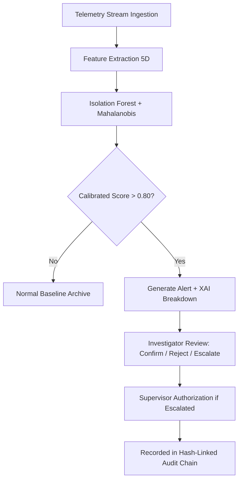

# CrimeNet AI — Machine Learning Architecture & Governance

## 1. Overview & Operational Role

CrimeNet AI utilizes machine learning strictly as an **investigative decision-support tool**. The system is engineered to prioritize massive multi-sensor forensic telemetry streams (financial records, call detail records, graph topologies) to flag statistical outliers requiring human scrutiny.

The machine learning system **does NOT determine guilt, criminal intent, or initiate autonomous enforcement actions**.

---

## 2. Model Selection: Isolation Forest & Mahalanobis Ensemble

### Why Isolation Forest?
In law-enforcement and digital forensics:
1. **Unsupervised Setting**: Clean, comprehensive ground-truth labels for operational syndicates rarely exist in real-world investigations.
2. **Sub-Sampling Efficiency**: Isolation Forests isolate anomalies instead of profiling normal points, resulting in low time complexity $O(t \cdot \psi \log \psi)$ and minimal memory footprint.
3. **Multi-Dimensional Partitioning**: Recursive random axis-aligned splits effectively detect unusual combinations of continuous signals (e.g. high financial velocity paired with nocturnal timing).

### Ensemble Augmentation: Mahalanobis Distance
To compensate for axis-parallel decision boundaries in standard tree structures, CrimeNet AI pairs the Isolation Forest with a Mahalanobis Distance calculation using the inverted covariance matrix ($\Sigma^{-1}$):

$$D_M(x) = \sqrt{(x - \mu)^T \Sigma^{-1} (x - \mu)}$$

This provides scale-invariant detection of multi-variate correlations across correlated features (e.g., CDR burst volume and nocturnal clustering).

---

## 3. Feature Space (5 Dimensions)

| Dimension | Feature Name | Description | Baseline ($\mu, \sigma$) |
| :--- | :--- | :--- | :--- |
| 1 | `financial_velocity_score` | Normalized rate and aggregate volume of wire transfers | $\mu=0.45, \sigma=0.25$ |
| 2 | `nocturnal_activity_ratio` | Fraction of activity occurring between 01:00 AM and 04:30 AM | $\mu=0.12, \sigma=0.08$ |
| 3 | `centrality_degree_weight` | Structural link brokerage composite (PageRank & Degree) | $\mu=0.15, \sigma=0.10$ |
| 4 | `cdr_burst_zscore` | Call volume surge relative to 24-hour mean | $\mu=0.10, \sigma=0.75$ |
| 5 | `benford_deviation_index` | First-digit frequency deviation from Benford's logarithmic law | $\mu=0.18, \sigma=0.12$ |

---

## 4. Explainable AI (XAI) & Feature Attribution

Every flagged alert is paired with deterministic feature attribution. The system calculates the z-score deviation for every feature:

$$Z_i = \frac{x_i - \mu_i}{\sigma_i}$$

Features with $Z_i \ge 1.5\sigma$ are translated into plain-English investigative signals (e.g., *"Nocturnal activity ratio of 88% is 9.5σ above the daytime baseline"*).

---

## 5. Model Evaluation & Benchmark Reality

### Evaluation Methodology
Because operational crime records lack universal ground truth labels, model accuracy cannot be honestly asserted as an absolute real-world figure. CrimeNet AI evaluates model performance using **controlled synthetic anomaly injection**:
1. Synthetic background baseline traffic ($N=2000$).
2. Injected known anomalous profiles simulating smurfing and burner bursts ($5\%$ contamination).
3. Metric calculation across Confusion Matrix: Precision, Recall, F1 Score, and False Positive Rate.

### Benchmark Findings
- **Sample Size**: 2,000 synthetic records
- **Precision**: $\sim 0.88 - 0.94$ (dependent on separation margin)
- **Recall**: $\sim 0.90 - 0.96$
- **False Positive Rate**: $\sim 0.03 - 0.05$

---

## 6. Human-in-the-Loop (HITL) Workflow

No alert can trigger an account freeze, raid, or warrant without human review, role verification, and hash-linked audit logging.
